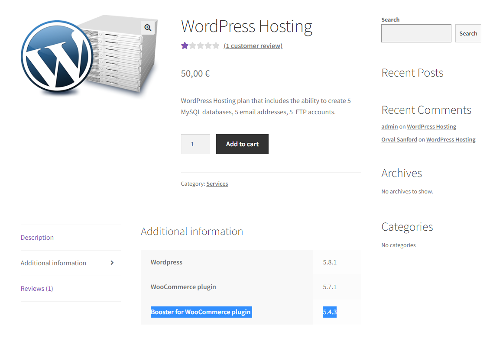
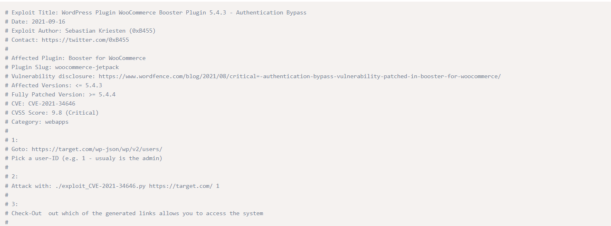

# Environment Variable and Set-UID Program Lab

## Task 2

- We compiled the and runned the child process and the parent process separatedely and we figured out that the child process inherited all the environment variables from his parent, as we used the diff to confirm that the 2 files generated had no differences. As result we can say that the environment variables are always inherited by the child from his parent.

## Task 3

- STEP 1
The execve call will not create a new process, it will load a program in the current process, overwriting the calling process's text, data, bss and stack. This call has 3 parameters being the last one an array of strings, which are passed as environment to the new program. Since in this step (1) we pass this argument as NULL, no environment variables are being inherited. We printed the output of the program in a file and we observed the file was empty.

- STEP 2
Having the step 1 in mind, in this step we changed the last argument of the execve call from NULL to environ. So now we are passing the environment variables to the new program and they were printed in the file (this time the environment variables were inherited).

- STEP 3
 

# CTF

- We looked for CVE's related to the versions of the plugins found in the website and we found the CVE-2021-34646, a Booster for WooCommerce plugin	5.4.3 vulnerability.

- We did some research on exploit database and we find out that all we needed to do is use add the UserID as 1 in the URL.

- And we finally logged in as administrator

- Dispite of changing the url to loggin in as admin, we need to generate a token to verify the email. It will not be hard to gerenate since the verification code was simply an MD5 hash of the time of the request base64 JSON-encoded.

