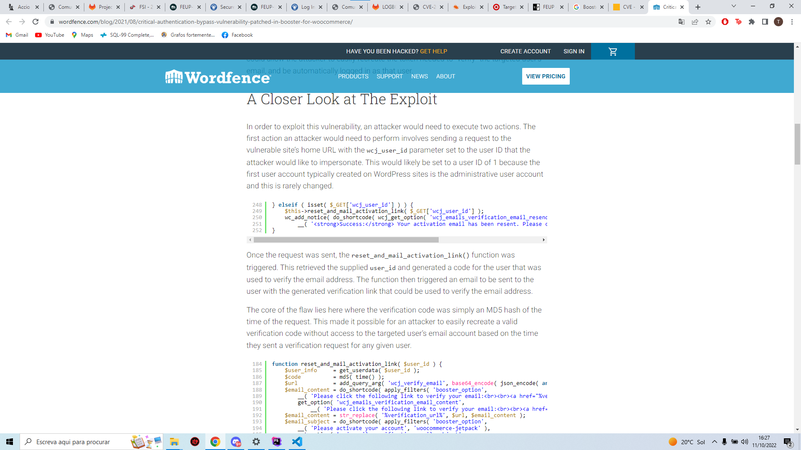

# Environment Variable and Set-UID Program Lab

## Task 2

- We compiled the and runned the child process and the parent process separatedely and we figured out that the child process inherited all the environment variables from his parent, as we used the diff to confirm that the 2 files generated had no differences. As result we can say that the environment variables are always inherited by the child from his parent.

## Task 3

- STEP 1
The execve call will not create a new process, it will load a program in the current process, overwriting the calling process's text, data, bss and stack. This call has 3 parameters being the last one an array of strings, which are passed as environment to the new program. Since in this step (1) we pass this argument as NULL, no environment variables are being inherited. We printed the output of the program in a file and we observed the file was empty.

- STEP 2
Having the step 1 in mind, in this step we changed the last argument of the execve call from NULL to environ. So now we are passing the environment variables to the new program and they were printed in the file (this time the environment variables were inherited).

- STEP 3
If the "environ" is not passed in the execve call, the environment variables are not passed to the new process. Otherwise, the environment variables remain the same.
 
## Task 4

- STEP 1
The system() call "automatically" creates a child process that allows you to execute the shell command and terminate the current program. While the execve() call replaces the current process with the requested command execution, to have a similar effect as system we would have to use fork().

## Task 5

- STEP 1
Set-UID (set user ID on execution) is a special kind of permission in Unix and Unix-like OS (like linux). It allows you to run certain programs with escalated privileges.
The shell has implementations against allowing access to sensitive variables when running with escalated privileges (i.e. running with another user's permissions).
All the variables set in the shell process are printed in the child process.

## Task 6

- STEP 1
By running the Task 6 program (from the code requested to be compiled), with set-UID (escalated privileges), and executed the 'ls' command via a system(), which at the time of execution had root privileges. At the time, the temporary environment variable pointed to ls for the zsh program (when we did: sudo ln -sf /bin/zsh /bin/sh). Since zsh was run with root privileges, we were able to have a shell with escalated privileges (and bypass the protection of /bin/sh and /bin/bash that changed the shell to the real id (remove privileges)).

# CTF

- We looked for CVE's related to the versions of the plugins found in the website and we found the CVE-2021-34646, a Booster for WooCommerce plugin	5.4.3 vulnerability.

- We did some research on exploit database and we find out that all we needed to do is use add the UserID as 1 in the URL.

- And we finally logged in as administrator

- Dispite of changing the url to loggin in as admin, we need to generate a token to verify the email. It will not be hard to gerenate since the verification code was simply an MD5 hash of the time of the request base64 JSON-encoded.